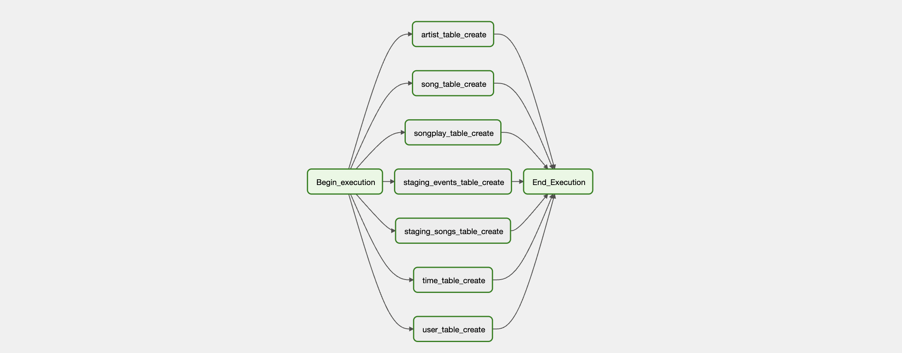

# Data Pipelines with Airflow

## Introduction
A music streaming company, Sparkify, has decided that it is time to introduce more automation and monitoring to their data warehouse ETL pipelines and come to the conclusion that the best tool to achieve this is Apache Airflow.

They have decided to bring you into the project and expect you to create high grade data pipelines that are dynamic and built from reusable tasks, can be monitored, and allow easy backfills. They have also noted that the data quality plays a big part when analyses are executed on top the data warehouse and want to run tests against their datasets after the ETL steps have been executed to catch any discrepancies in the datasets.

The source data resides in S3 and needs to be processed in Sparkify's data warehouse in Amazon Redshift. The source datasets consist of JSON logs that tell about user activity in the application and JSON metadata about the songs the users listen to.

## Project Dataset
For this project, you'll be working with two datasets. Here are the s3 links for each:

- Log data: s3://udacity-dend/log_data
- Song data: s3://udacity-dend/song-data

*Tip*: Copy the data to your own bucket.

## Copy S3 Data
The data for the project is stored in Udacity's S3 bucket. This bucket is in the US West AWS Region. To simplify things, copy the data to your bucket in the same AWS Region where you created the Redshift workgroup (in the data-warehouse project) so that Redshift can access the bucket. 

If you haven't already, create your own S3 bucket using the AWS Cloudshell (this is just an example - buckets need to be unique across all AWS accounts): `aws s3 mb s3://gracomot-airflow/`

Copy the data from the udacity bucket to the home cloudshell directory:

```python
aws s3 cp s3://udacity-dend/log-data/ ~/log-data/ --recursive
aws s3 cp s3://udacity-dend/song-data/ ~/song-data/ --recursive
aws s3 cp s3://udacity-dend/log_json_path.json ~/
```
Copy the data from the home cloudshell directory to your own bucket -- this is only an example:

```python
aws s3 cp ~/log-data/ s3://gracomot-airflow/log-data/ --recursive
aws s3 cp ~/song-data/ s3://gracomot-airflow/song-data/ --recursive
aws s3 cp ~/log_json_path.json s3://gracomot-airflow/
```
List the data in your own bucket to be sure it copied over -- this is only an example:

```python
aws s3 ls s3://gracomot-airflow/log-data/
aws s3 ls s3://gracomot-airflow/song-data/
aws s3 ls s3://gracomot-airflow/log_json_path.json
```
### DAGS
Two dags were created for the project
-   create_project_tables_dag
-   final_project_dag

The create_table_dags handles all the table creation processes for the tables used in the projects. The dag is shown below:


The create_table_dags handles the loading of staging, fact and dimension tables. The dag is shown below:


## Initiating the Airflow Web Server
Ensure [Docker Desktop](https://www.docker.com/products/docker-desktop/) is installed before proceeding.

To bring up the entire app stack up, we use [docker-compose](https://docs.docker.com/engine/reference/commandline/compose_up/) as shown below

```bash
docker-compose up -d
```
Visit http://localhost:8080 once all containers are up and running.

## Configuring Connections in the Airflow Web Server UI


On the Airflow web server UI, use `airflow` for both username and password.
* Post-login, navigate to **Admin > Connections** to add required connections - specifically, `aws_credentials` and `redshift`.
* Don't forget to start your Redshift cluster via the AWS console.
* After completing these steps, run your DAG to ensure all tasks are successfully executed.

## Getting Started with the Project
1. The project template package comprises three key components:
   * The **DAG template** includes imports and task templates but lacks task dependencies.
   * The **operators** folder with operator templates.
   * A **helper class** for SQL transformations.

1. With these template files, you should see the new DAG in the Airflow UI, with a graph view resembling the screenshot below:

You should be able to execute the DAG successfully, but if you check the logs, you will see only `operator not implemented` messages.

## DAG Configuration
In the DAG, add `default parameters` based on these guidelines:
* No dependencies on past runs.
* Tasks are retried three times on failure.
* Retries occur every five minutes.
* Catchup is turned off.
* No email on retry.

Additionally, configure task dependencies to match the flow depicted in the image below:


## Developing Operators
To complete the project, build four operators for staging data, transforming data, and performing data quality checks. While you can reuse code from Project 2, leverage Airflow's built-in functionalities like connections and hooks whenever possible to let Airflow handle the heavy lifting.

### Stage Operator
Load any JSON-formatted files from S3 to Amazon Redshift using the stage operator. The operator should create and run a SQL COPY statement based on provided parameters, distinguishing between JSON files. It should also support loading timestamped files from S3 based on execution time for backfills.

### Fact and Dimension Operators
Utilize the provided SQL helper class for data transformations. These operators take a SQL statement, target database, and optional target table as input. For dimension loads, implement the truncate-insert pattern, allowing for switching between insert modes. Fact tables should support append-only functionality.

### Data Quality Operator
Create the data quality operator to run checks on the data using SQL-based test cases and expected results. The operator should raise an exception and initiate task retry and eventual failure if test results don't match expectations.

## Reviewing Starter Code
Before diving into development, familiarize yourself with the following files:
- [plugins/operators/data_quality.py](plugins/operators/data_quality.py)
- [plugins/operators/load_fact.py](plugins/operators/load_fact.py)
- [plugins/operators/load_dimension.py](plugins/operators/load_dimension.py)
- [plugins/operators/stage_redshift.py](plugins/operators/stage_redshift.py)
- [plugins/helpers/sql_queries.py](plugins/helpers/sql_queries.py)
- [dags/final_project.py](dags/final_project.py)

Now you're ready to embark on this exciting journey into the world of Data Pipelines with Airflow!
